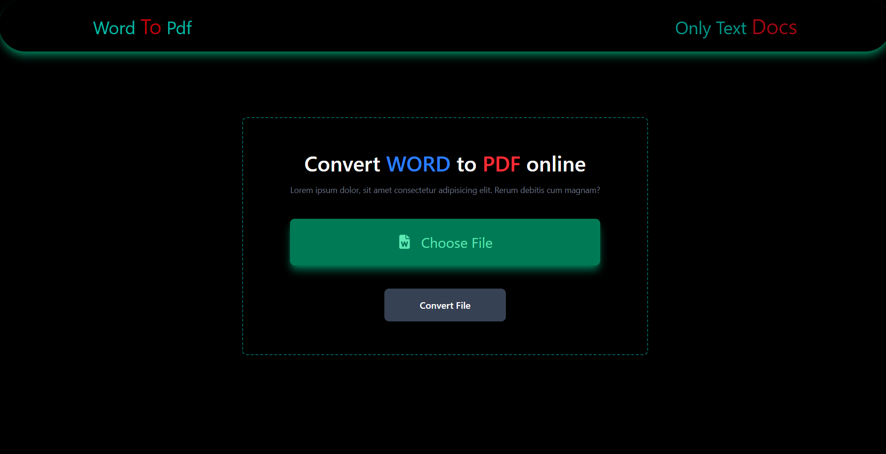
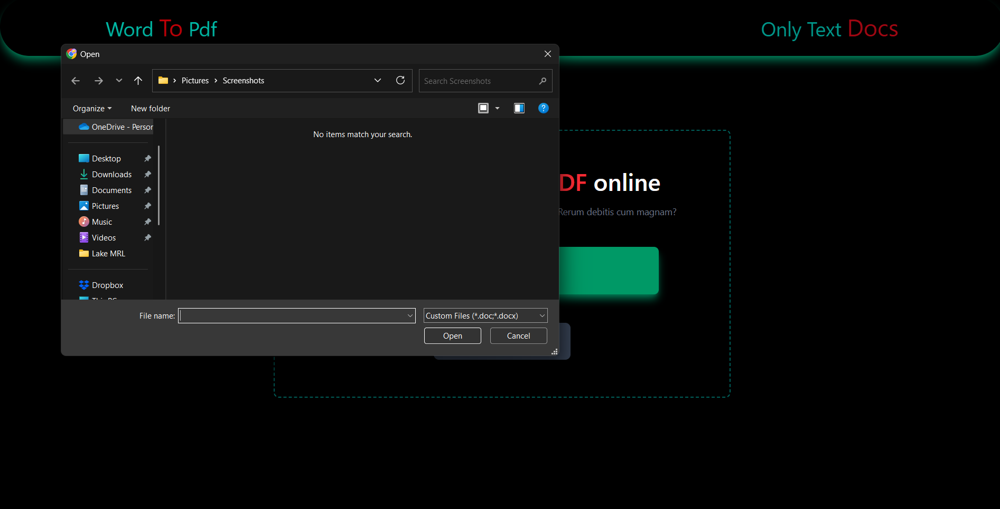

# 📝 PDF Maker App

A powerful and responsive **PDF Maker** web application that allows users to upload Word documents, convert them into styled HTML using **Mammoth.js**, 
and generate downloadable PDFs using **PDFKit** — all through a seamless frontend interface built with **React** and **Tailwind CSS**.

---

##  Features

- 📄 **Upload `.docx` Files** and extract clean, semantic HTML
- 🎨 **Responsive UI** built with Tailwind CSS
- 🔧 **Backend PDF Generation** using PDFKit
- ⚡ **Fast Conversion** of content into downloadable PDFs
- 📱 **Mobile-Friendly Design**

---

## 🛠️ Tech Stack

### 🔹 Frontend
- React
- Tailwind CSS
- Axios

### 🔹 Backend
- Express.js
- PDFKit
- Mammoth.js
- Multer (for file uploads)

---

## 📸 Screenshots





---

## 📦 Installation

### Clone the repository:

```bash
git clone https://github.com/your-username/PDF-Maker.git
cd PDF-Maker

```

# Backend Setup:
-cd backend
-npm install
-npm run dev

# Frontend Setup:
-cd frontend
-npm install
-npm run dev


---


